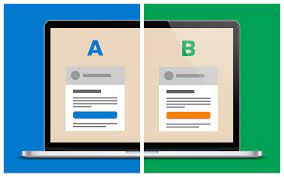

# Data Science Portfolio
---
## Data Analysis

### A/B Testing
Analyzing company's two pages(old and new) to check if the new page is more attractive to users and if it increases the conversion rate(buying company's products) of the page.

